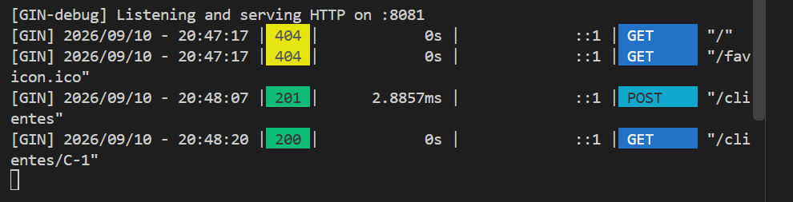
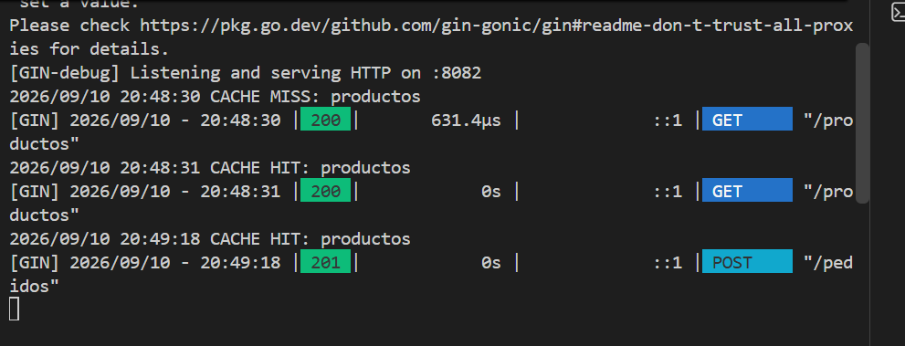
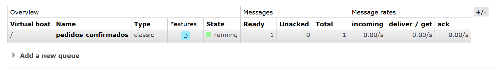
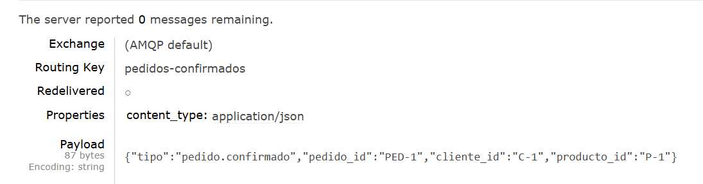

# TP 1-4: de monolito a microservicios

**Alumna:** Sofía Peiretti

Separación del monolito de e-commerce en dos microservicios independientes, con caché para productos y publicación del evento `pedido.confirmado` en RabbitMQ.

```text
cliente -> clientes :8081
        -> pedidos  :8082

pedidos -- pedido.confirmado --> RabbitMQ (cola pedidos-confirmados) --> logística (conceptual)
```

## Estructura

```text
microservicios/
├── compose.yaml                 # RabbitMQ
├── clientes/
│   ├── controllers/             # HTTP (gin)
│   ├── services/                # validaciones y lógica
│   ├── repositories/            # datos en memoria
│   ├── models/
│   └── main.go                  # cableado y servidor :8081
├── pedidos/
│   ├── controllers/
│   ├── services/                # confirma el pedido y publica el evento
│   ├── repositories/            # productos, caché de productos y pedidos en memoria
│   ├── messaging/               # publisher de RabbitMQ
│   ├── models/
│   └── main.go                  # cableado y servidor :8082
└── evidencia/                   # capturas de la prueba
```

## Microservicio `clientes` (puerto 8081)

| Método | Endpoint | Descripción |
| --- | --- | --- |
| `POST` | `/clientes` | Crea un cliente. Body: `{"nombre": "Ana Pérez"}`. Devuelve el cliente con su ID (`C-1`, `C-2`, ...). |
| `GET` | `/clientes/:id` | Devuelve el cliente o `404` si no existe. |

## Microservicio `pedidos` (puerto 8082)

| Método | Endpoint | Descripción |
| --- | --- | --- |
| `GET` | `/productos` | Lista los productos. Usa caché en memoria. |
| `POST` | `/pedidos` | Confirma un pedido. Body: `{"cliente_id": "C-1", "producto_id": "P-1"}`. |

**Caché:** `ProductosCache` envuelve al repositorio de productos. Si el listado está guardado y no venció (TTL de 1 minuto), lo devuelve directamente (`CACHE HIT`). Si no, lo pide al repositorio y lo guarda (`CACHE MISS`).

**Evento:** cuando el servicio confirma un pedido, publica en la cola `pedidos-confirmados`:

```json
{
  "tipo": "pedido.confirmado",
  "pedido_id": "PED-1",
  "cliente_id": "C-1",
  "producto_id": "P-1"
}
```

La conexión, la declaración de la cola y la publicación están en `pedidos/messaging/rabbitmq_publisher.go`. Logística no se implementa, solo es el destinatario conceptual del evento.

## Ejecución

1. Levantar RabbitMQ (desde esta carpeta):

```bash
   docker compose up -d
```

2. Levantar cada microservicio en una terminal distinta:

```bash
   cd clientes
   go mod tidy
   go run .
```

```bash
   cd pedidos
   go mod tidy
   go run .
```

3. Probar (PowerShell):

```powershell
   Invoke-RestMethod -Method Post -Uri http://localhost:8081/clientes -ContentType "application/json" -Body '{"nombre":"Ana Pérez"}'
   Invoke-RestMethod http://localhost:8081/clientes/C-1
   Invoke-RestMethod http://localhost:8082/productos
   Invoke-RestMethod -Method Post -Uri http://localhost:8082/pedidos -ContentType "application/json" -Body '{"cliente_id":"C-1","producto_id":"P-1"}'
```

4. Verificar el evento en el panel de RabbitMQ: http://localhost:15672 (usuario `user`, contraseña `pass`), cola `pedidos-confirmados`.

## Evidencia

**Microservicio `clientes`:** alta (`201`) y consulta (`200`) de un cliente.



**Microservicio `pedidos`:** el primer `GET /productos` es `CACHE MISS` y el segundo `CACHE HIT`. Después, el pedido se confirma (`201`).



**RabbitMQ:** la cola `pedidos-confirmados` recibió el mensaje (Ready = 1).



**Contenido del evento publicado:**



## Decisión de por que se elimino carpeta eventos

El evento `pedido.confirmado` se definió dentro de `pedidos/models`, ya que por ahora es el único servicio que lo usa 